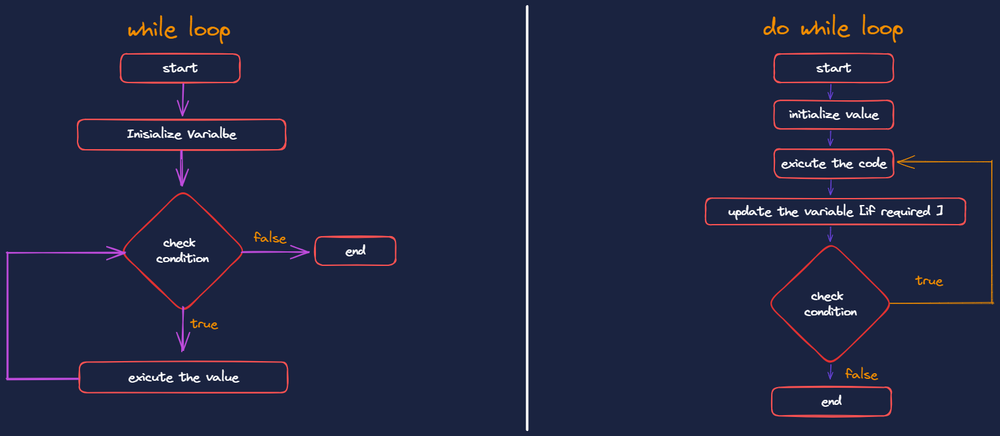

# 40 Days of javaScript with tapaScript in day 05

## 📋 Tasks: 1. Generate a Pyramid Pattern using Nested Loop as it is shown below:

```bash
*
* *
* * *
* * * *
* * * * *
```

# ✅ Answer

```js
console.log("Generate a Pyramid Pattern");
for (let i = 1; i <= 5; i++) {
  let star = "";
  for (let row = 1; row <= i; row++) {
    star += "*";
  }
  console.log(star);
}
```

## 📋 Tasks: 2. Craete Multiplication Table (Using for loop)

Write a program to print the multiplication table of a given number up to 10.
For Example: If N = 3, output should be:

```bash
3 x 1 = 3
3 x 2 = 6
...
3 x 10 = 30
```

# ✅ Answer

```js
for (let n = 1; n <= 10; n++) {
  let namota = "";
  for (let j = 1; j <= 10; j++) {
    if (n === 3) {
      namota = n * j;
      console.log(n, "*", j, "=", namota);
    }
  }
}
```

## 📋 Tasks: 3. Find the summation of all odd numbers between 1 to 500 and print them on teh console log.

# ✅ Answer

```js
let sum = 0;
for (let n = 1; n <= 500; n++) {
  if (n % 2 === 1) {
    sum += n;
  }
}
console.log(sum);
```

## 📋 Tasks: 4. Skipping Multiples of 3

Write a program to print numbers from 1 to 20, but skip multiples of 3.

# ✅ Answer

```js
for (let n = 1; n <= 20; n++) {
  if (n === 3) {
    continue;
  }
  console.log(n);
}
```

## 📋 Tasks: 6. Write your understanding on the difefrences between for, while, and do-while loop. Create their flow charts.

# ✅ Answer

### ⚖️ Difference between For, While and Do-While Loop in Programming:

| Feature                         | while Loop                                                                            | do while Loop                                                                                   |
| ------------------------------- | ------------------------------------------------------------------------------------- | ----------------------------------------------------------------------------------------------- |
| Syntax                          | while (condition) { }                                                                 | do { } while (condition);                                                                       |
| Initialization                  | Declared outside the loop; should be done explicitly before the loop.                 | Declared outside the loop structure                                                             |
| Condition                       | Checked before each iteration.                                                        | Checked after each iteration.                                                                   |
| Update                          | Executed inside the loop; needs to be handled explicitly.                             | Executed inside the loop; needs to be handled explicitly.                                       |
| Use Cases                       | Useful when the number of iterations is not known in advance or based on a condition. | Useful when the loop block must be executed at least once, regardless of the initial condition. |
| Initialization and Update Scope | Scope extends beyond the loop; needs to be handled explicitly.                        | Scope extends beyond the loop; needs to be handled explicitly.                                  |

### 📈 Create their flow charts.


