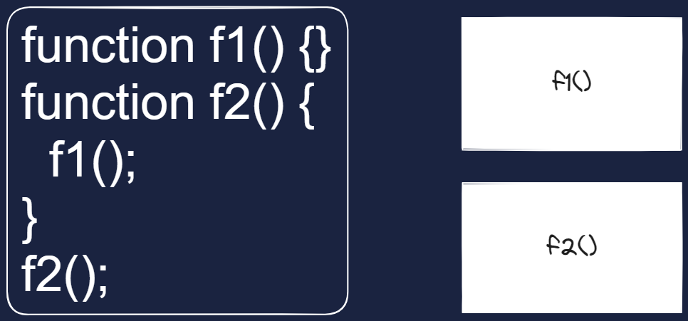

# 40 Dasy of javaScript with tapaScirp in Day 06

## 📋 Tasks: 1. Write a Function to Convert Celsius to Fahrenheit

Create a function celsiusToFahrenheit(celsius) that converts a temperature from Celsius to Fahrenheit.
Formula: (Celsius \* 9/5) + 32 = Fahrenheit

# ✅ Answer👇

```js
function celsiusToFahrenheit(celsius) {
  return (celsius * 9) / 5 + 32;
}

console.log(celsiusToFahrenheit(32));
```

## 📋 Tasks: 2. Create a Function to Find the Maximum of Two Numbers

Write a function findMax(num1, num2) that returns the larger of the two numbers. It should work for negative numbers as well.

# ✅ Answer👇

```js
function findMax(num1, num2) {
  return num1 < num2 ? num2 : num1;
}
console.log(findMax(70, 60));
```

## 📋 Tasks: 3. Function to Check if a String is a Palindrome

Create a function isPalindrome(str) that checks if a given string is a palindrome (reads the same forward and backward). You can not use any string function that we have not learned in the series so far.

# ✅ Answer👇

```js
function isPalindrome(str) {
  let rev = "";
  for (let i = str.length - 1; i >= 0; i--) {
    rev += str[i];
  }
  if (rev == str) {
    console.log("is Palindrome");
  } else {
    console.log("is not Palindrom");
  }
}
console.log(isPalindrome("racecar"));
console.log(isPalindrome("madam"));
console.log(isPalindrome("tapas"));
```

## 📋 Tasks: 4. Write a Function to Find Factorial of a Number

Create a function factorial(n) that returns the factorial of n.
Example 5! = 5 _ 4 _ 3 _ 2 _ 1

# ✅ Answer👇

```js
function factorial(n) {
  let fac = 1;
  for (n; n >= 1; n--) {
    fac = fac * n;
  }
  return fac;
}
console.log(factorial(4));
```

## 📋 Tasks: 5. Write a function to Count Vowels in a String

Write a function countVowels(str) that counts the number of vowels (a, e, i, o, u) in a given string.

# ✅ Answer👇

```js
function countVowels(str) {
  return str.length;
}
console.log(countVowels("tapaScript"));
```

## 📋 Tasks: 6. Write a Function to Capitalize the First Letter of Each Word in a Sentence

Write a function capitalizeWords(sentence) that takes a sentence and capitalizes the first letter of each word. You can use the toUpperCase() method of string to convert the lowercase to uppercase.

# ✅ Answer👇

```js
function capitalizeWords(sentence) {
  return sentence.toUpperCase();
}
console.log("bangladesh=> ", capitalizeWords("bangladesh"));
```

## 📋 Tasks: 7. Use an IIFE to Print “Hello, JavaScript!”

Write an IIFE that prints "Hello, JavaScript!" to the console. Here the Second word must be supplied using paramneter and argument.

# ✅ Answer👇

```js
(function () {
  console.log("Hello, JavaScript!");
})();
```

## 📋 Tasks: 8. Create a Simple Callback Function

Write a function greet(name, callback), where callback prints a message using the name parameter.

# ✅ Answer👇

```js
function greet(name, callback) {
  console.log("Hello, " + name);
  callback();
}

function teacher() {
  console.log("tapaScript");
}

greet("tapas", teacher);
```

## 📋 Tasks: 9. Create Call Stack Execution Diagram for this flow

```js
function f1() {}
function f2() {
  f1();
}
f2();
```

# ✅ Answer👇


To create a **Call Stack Execution Diagram** for the given JavaScript code, we need to visualize how the call stack evolves as the code executes. The call stack is a data structure that tracks function calls in a program. When a function is called, it is added to the top of the stack, and when a function returns, it is removed from the stack.

Here’s the step-by-step execution flow and the corresponding call stack diagram:

---

### Code:

```javascript
function f1() {} // f1 does nothing
function f2() {
  f1(); // f2 calls f1
}
f2(); // f2 is called
```

---

### Execution Flow:

1. **Global Execution Context (GEC)** is created when the script starts running.
2. `f2()` is called, so `f2` is added to the call stack.
3. Inside `f2`, `f1()` is called, so `f1` is added to the call stack.
4. `f1` completes execution and is removed from the call stack.
5. `f2` completes execution and is removed from the call stack.
6. The program ends.

---

### Call Stack Diagram:

| Step | Call Stack      | Description                                                    |
| ---- | --------------- | -------------------------------------------------------------- |
| 1    | `[GEC]`         | Global Execution Context is created.                           |
| 2    | `[GEC, f2]`     | `f2()` is called and added to the call stack.                  |
| 3    | `[GEC, f2, f1]` | Inside `f2`, `f1()` is called and added to the call stack.     |
| 4    | `[GEC, f2]`     | `f1()` completes execution and is removed from the call stack. |
| 5    | `[GEC]`         | `f2()` completes execution and is removed from the call stack. |
| 6    | `[]`            | Program ends, and the call stack is empty.                     |

---

### Visualization:

```
Step 1: [GEC]
Step 2: [GEC, f2]
Step 3: [GEC, f2, f1]
Step 4: [GEC, f2]
Step 5: [GEC]
Step 6: []
```

---

### Explanation of the Diagram:

- **GEC**: The Global Execution Context is always at the bottom of the stack.
- **f2**: When `f2()` is called, it is added to the stack.
- **f1**: When `f1()` is called inside `f2`, it is added to the stack on top of `f2`.
- As functions complete execution, they are removed from the stack in a Last-In-First-Out (LIFO) order.

---

### Key Points:

- The call stack follows the **LIFO (Last In, First Out)** principle.
- Each function call creates a new execution context, which is pushed onto the stack.
- When a function returns, its execution context is popped off the stack.

This diagram helps you understand how JavaScript manages function calls and execution contexts during runtime.

## 📋 Tasks: 10. Create Call Stack Execution Diagram for this flow

```js
function f1() {}
function f2() {}
function f3() {
  f1();
}
f2();
f3();
f1();
```

# ✅ Answer👇


To create a **Call Stack Execution Diagram** for the given JavaScript code, we need to visualize how the call stack evolves as the code executes. The call stack is a data structure that tracks function calls in a program. When a function is called, it is added to the top of the stack, and when a function returns, it is removed from the stack.

Here’s the step-by-step execution flow and the corresponding call stack diagram:

---

### Code:

```javascript
function f1() {} // f1 does nothing
function f2() {} // f2 does nothing
function f3() {
  f1(); // f3 calls f1
}
f2(); // f2 is called
f3(); // f3 is called
f1(); // f1 is called directly
```

---

### Execution Flow:

1. **Global Execution Context (GEC)** is created when the script starts running.
2. `f2()` is called, so `f2` is added to the call stack.
3. `f2` completes execution and is removed from the call stack.
4. `f3()` is called, so `f3` is added to the call stack.
5. Inside `f3`, `f1()` is called, so `f1` is added to the call stack.
6. `f1` completes execution and is removed from the call stack.
7. `f3` completes execution and is removed from the call stack.
8. `f1()` is called directly, so `f1` is added to the call stack.
9. `f1` completes execution and is removed from the call stack.
10. The program ends.

---

### Call Stack Diagram:

| Step | Call Stack      | Description                                                    |
| ---- | --------------- | -------------------------------------------------------------- |
| 1    | `[GEC]`         | Global Execution Context is created.                           |
| 2    | `[GEC, f2]`     | `f2()` is called and added to the call stack.                  |
| 3    | `[GEC]`         | `f2()` completes execution and is removed from the call stack. |
| 4    | `[GEC, f3]`     | `f3()` is called and added to the call stack.                  |
| 5    | `[GEC, f3, f1]` | Inside `f3`, `f1()` is called and added to the call stack.     |
| 6    | `[GEC, f3]`     | `f1()` completes execution and is removed from the call stack. |
| 7    | `[GEC]`         | `f3()` completes execution and is removed from the call stack. |
| 8    | `[GEC, f1]`     | `f1()` is called directly and added to the call stack.         |
| 9    | `[GEC]`         | `f1()` completes execution and is removed from the call stack. |
| 10   | `[]`            | Program ends, and the call stack is empty.                     |

---

### Visualization:

```
Step 1: [GEC]
Step 2: [GEC, f2]
Step 3: [GEC]
Step 4: [GEC, f3]
Step 5: [GEC, f3, f1]
Step 6: [GEC, f3]
Step 7: [GEC]
Step 8: [GEC, f1]
Step 9: [GEC]
Step 10: []
```

---

### Explanation of the Diagram:

- **GEC**: The Global Execution Context is always at the bottom of the stack.
- **f2**: When `f2()` is called, it is added to the stack.
- **f3**: When `f3()` is called, it is added to the stack.
- **f1**: When `f1()` is called inside `f3` or directly, it is added to the stack.
- As functions complete execution, they are removed from the stack in a Last-In-First-Out (LIFO) order.

---

### Key Points:

- The call stack follows the **LIFO (Last In, First Out)** principle.
- Each function call creates a new execution context, which is pushed onto the stack.
- When a function returns, its execution context is popped off the stack.

This diagram helps you understand how JavaScript manages function calls and execution contexts during runtime.
