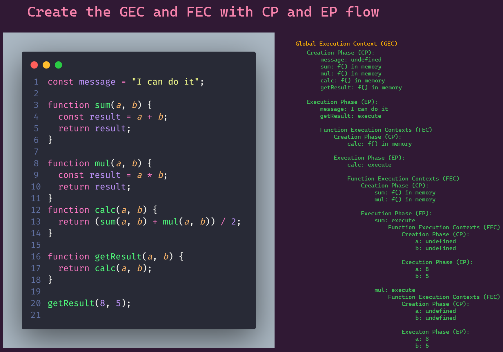
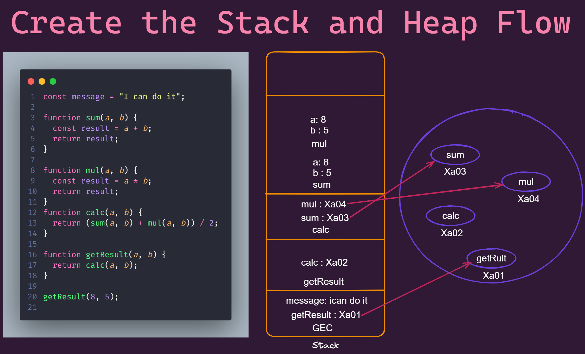

# 40 Days of javaScript with tapaScript in day 08

## Draw the Execution Context Diagram of the follwoing code and share as explained below:

## Execution Context Diagram

### Global Execution Context (GEC)

- Creation Phase (CP):

  - Memory allocated for `message` and functions (`sum`, `mul`, `calc`, `getResult`).
  - `message` is assigned `undefined` initially.

- Execution Phase (EP):

  - `message` is assigned `"I can do it"`.

  - Functions are stored in memory.

  - `getResult(8, 5)` is invoked.

### Function Execution Contexts (FEC)

1. `getResult(8, 5)`

   - Calls `calc(8, 5)`.

2. `calc(8, 5)`

   - Calls `sum(8, 5)`.

3. `sum(8, 5)`

   - Computes `result = 8 + 5 = 13`.

   - Returns `13`.

4. `calc(8, 5)`

   - Calls` mul(8, 5)`.

5.` mul(8, 5)`

- Computes `result = 8 \* 5 = 40`.

- Returns `40`.

6. `calc(8, 5)`

   - Computes `(13 + 40) / 2 = 26.5`.

   - Returns `26.5`.

7. `getResult(8, 5)`

   - Returns `26.5`.

## Stack and Heap Flow

- Stack (Call Stack)

  1. GEC is created.

  2. `getResult(8, 5)` is pushed.

  3. `calc(8, 5)` is pushed.

  4. `sum(8, 5)` is pushed and then popped.

  5. `mul(8, 5)` is pushed and then popped.

  6. `calc(8, 5)` is popped.

  7. `getResult(8, 5)` is popped.

  8. GEC remains.

- Heap

  - Stores `"I can do it"` and function definitions.

## Stack Diagram

(While executing getResult(8, 5), the stack grows and shrinks as functions are called and returned.)
